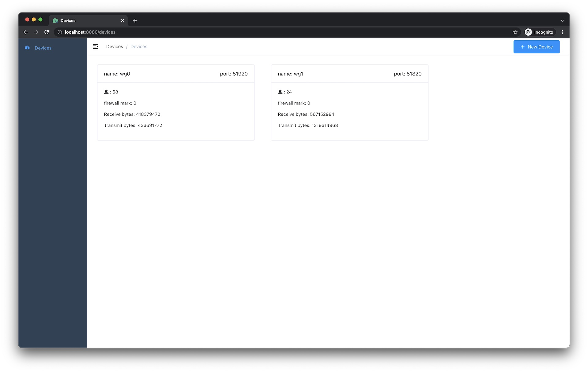
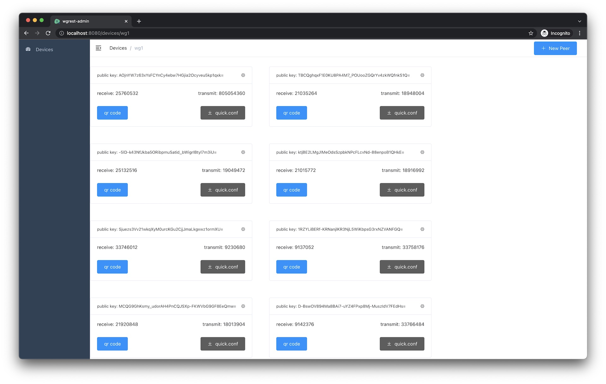
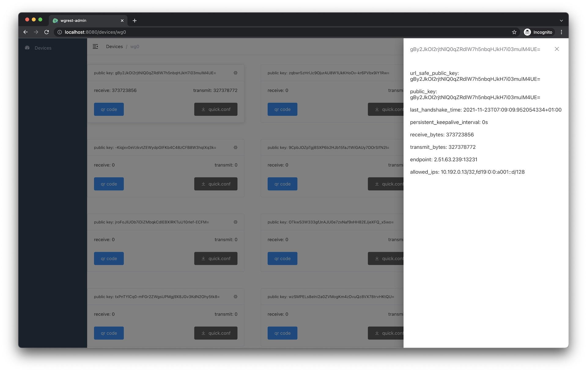
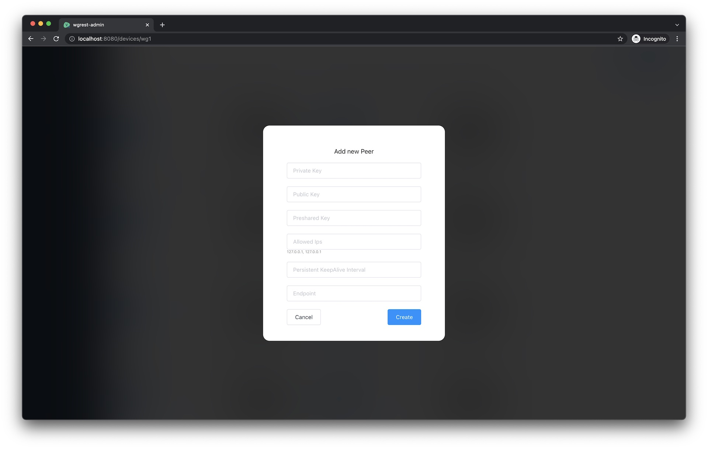
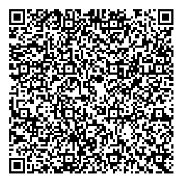

# wgrest

[](https://drone.forestvpn.com/suquant/wgrest)

WireGuard REST API

WireGuard is an simple and modern VPN. It is cross-platform (Windows, macOS, BSD, iOS, Android).

Swagger UI: https://wgrest.forestvpn.com/swagger/

1|2|3|4
:---:|:---:|:---:|:---:
[](examples/screenshots/wgrest-devices-list.jpg) | [](examples/screenshots/wgrest-device-peers-list.jpg) | [](examples/screenshots/wgrest-device-peer-info.jpg) | [](examples/screenshots/wgrest-add-new-peer.jpg)

## Features:

* Manage device: update wireguard interface
* Manage device's peers: create, update, and delete peers
* Peer's QR code, for use in WireGuard & ForestVPN client
* Peers search by query
* Peers sort by: pub_key, receive_bytes, transmit_bytes, total_bytes, last_handshake_time
* ACME TLS support
* Bearer token auth

Check all features [here](https://wgrest.forestvpn.com/swagger/)

## Install

```shell
curl -L https://github.com/suquant/wgrest/releases/download/1.0.0-alpha1/wgrest-linux-amd64 -o wgrest

chmod +x wgrest
```

## Run WireGuard REST API Server

```shell
wgrest --static-auth-token "secret" --listen "127.0.0.1:8080"
```

```shell
Output:

⇨ http server started on 127.0.0.1:8000
```

## Update **wg0** device

```shell
curl -v -g \
    -H "Content-Type: application/json" \
    -H "Authorization: Bearer secret" \
    -X PATCH \
    -d '{
        "listen_port":51820, 
        "private_key": "cLmxIyJx/PGWrQlevBGr2LQNOqmBGYbVfu4XcRO2SEo="
    }' \
    http://127.0.0.1:8000/v1/devices/wg0/
```

```json
{
  "name": "wg0",
  "listen_port": 51820,
  "public_key": "7TvriTzbaXdrsGXI8oMrMoNAWrVCXRUfiEvksOewLyg=",
  "firewall_mark": 0,
  "networks": null,
  "peers_count": 7,
  "total_receive_bytes": 0,
  "total_transmit_bytes": 0
}
```

## Get devices

```shell
curl -v -g \
    -H "Content-Type: application/json" \
    -H "Authorization: Bearer secret" \
    -X GET \
    http://127.0.0.1:8000/v1/devices/
```

```json
[
  {
    "name": "wg0",
    "listen_port": 51820,
    "public_key": "7TvriTzbaXdrsGXI8oMrMoNAWrVCXRUfiEvksOewLyg=",
    "firewall_mark": 0,
    "networks": null,
    "peers_count": 7,
    "total_receive_bytes": 0,
    "total_transmit_bytes": 0
  }
]
```

## Add peer

```shell
curl -v -g \
    -H "Content-Type: application/json" \
    -H "Authorization: Bearer secret" \
    -X POST \
    -d '{
        "allowed_ips": ["10.10.1.2/32"], 
        "preshared_key": "uhFI9c9rInyxqgZfeejte6apHWbewoiy32+Bo34xRFs="
    }' \
    http://127.0.0.1:8000/v1/devices/wg0/peers/
```

```json
{
  "public_key": "zTCuhw7g4Q7YVH6xpCjrz48UJ7qqJBwrXUpuofUTzD8=",
  "url_safe_public_key": "zTCuhw7g4Q7YVH6xpCjrz48UJ7qqJBwrXUpuofUTzD8=",
  "preshared_key": "uhFI9c9rInyxqgZfeejte6apHWbewoiy32+Bo34xRFs=",
  "allowed_ips": [
    "10.10.1.2/32"
  ],
  "last_handshake_time": "0001-01-01T00:00:00Z",
  "persistent_keepalive_interval": "0s",
  "endpoint": "",
  "receive_bytes": 0,
  "transmit_bytes": 0
}
```

## Get peers

```shell
curl -v -g \
    -H "Content-Type: application/json" \
    -H "Authorization: Bearer secret" \
    -X GET \
    http://127.0.0.1:8000/v1/devices/wg0/peers/
```

```json
[
  {
    "public_key": "zTCuhw7g4Q7YVH6xpCjrz48UJ7qqJBwrXUpuofUTzD8=",
    "url_safe_public_key": "zTCuhw7g4Q7YVH6xpCjrz48UJ7qqJBwrXUpuofUTzD8=",
    "preshared_key": "uhFI9c9rInyxqgZfeejte6apHWbewoiy32+Bo34xRFs=",
    "allowed_ips": [
      "10.10.1.2/32"
    ],
    "last_handshake_time": "0001-01-01T00:00:00Z",
    "persistent_keepalive_interval": "0s",
    "endpoint": "",
    "receive_bytes": 0,
    "transmit_bytes": 0
  }
]
```

## Get peer's quick config QR code

```shell
curl -v -g \
    -H "Content-Type: application/json" \
    -H "Authorization: Bearer secret" \
    -X GET \
    http://127.0.0.1:8000/v1/devices/wg0/peers/zTCuhw7g4Q7YVH6xpCjrz48UJ7qqJBwrXUpuofUTzD8=/quick.conf.png?width=256
```



## Delete peer

Since the wireguard public key is the standard base64 encoded string, it is not safe to use in URI schema, is that
reason peer_id contains the same public key of the peer but encoded with URL safe base64 encoder.

peer_id can be retrieved either by `peer_id` field from peer list endpoint or by this rule

```shell
python3 -c "import base64; \
    print(\
        base64.urlsafe_b64encode(\
            base64.b64decode('hQ1yeyFy+bZn/5jpQNNrZ8MTIGaimZxT6LbWAkvmKjA=')\
        ).decode()\
    )"
```

delete peer request

```shell
curl -v -g \
    -H "Content-Type: application/json" \
    -H "Authorization: Bearer secret" \
    -X DELETE \
    http://127.0.0.1:8000/v1/devices/wg0/peers/
```

👉 Looking for Vue js developer to do UI interface for wgrest. For more details get in touch
with [me](https://github.com/suquant).

Credits:

- ForestVPN.com [Free VPN](https://forestvpn.com) for all
- SpaceV.net [VPN for teams](https://spacev.net)
